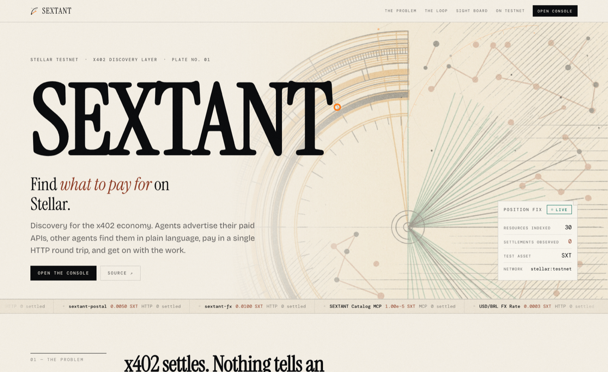
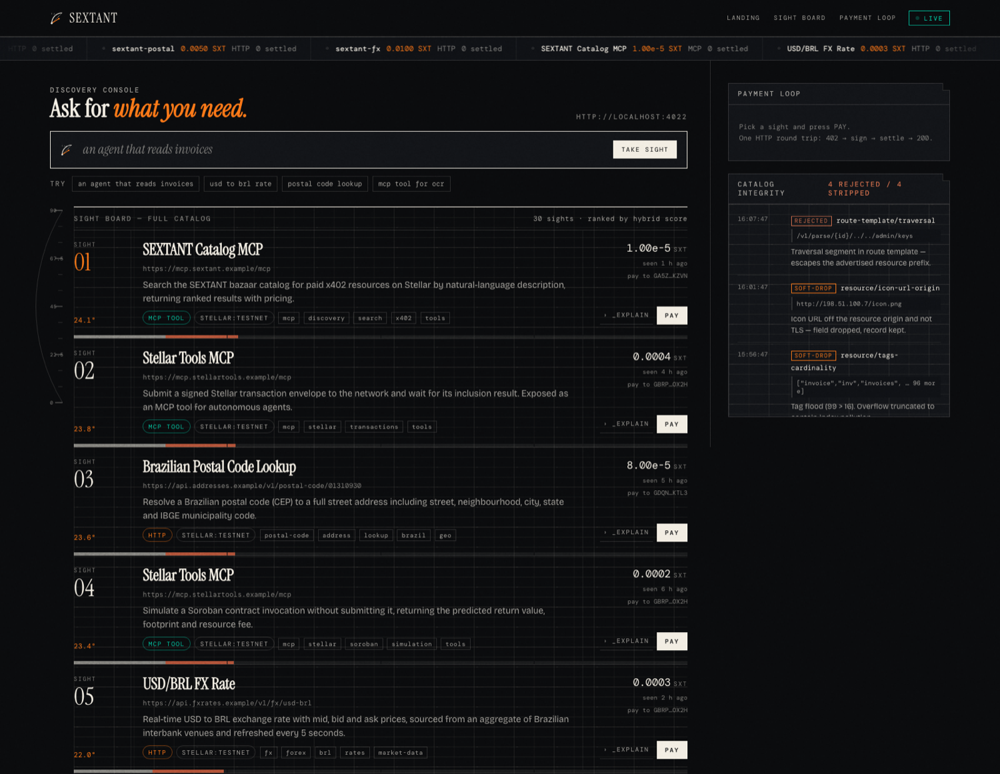

<div align="center">


# SEXTANT

### Find *what to pay for* on Stellar.

**The facilitator-side Bazaar discovery layer for x402 — the piece that does not exist in public code today — and the whole payment loop around it, running end to end on Stellar testnet.**

`Apache-2.0` · `stellar:testnet` · **20 settled transactions** · **70/70 tests passing**

Stellar Summit SP 2026 — sub-lane 3A, Agentic Payments (x402 / MPP)

</div>

<br>



---

## For evaluators — verify this in 60 seconds

You do not have to take any claim in this README on trust. Every one of them is checkable:

| Claim | How to check it | Time |
|---|---|---|
| Payments really settle on Stellar | Open [`c1acc578…`](https://stellar.expert/explorer/testnet/tx/c1acc578032a3a06a88603f971d871703f45b1246e0f1aa8862500495edbfba6) → `successful: true` | 10s |
| The buyer needs **zero XLM** — fees are sponsored | On that transaction, `fee_account` is the facilitator's `FEEPAYER`, not the payer | 15s |
| Catalog integrity is real, not decorative | `npm test` → 70 passed, 0 failed (66 of them adversarial) | 30s |
| **You can actually run it** | `npm install && npm run setup` — no captcha, no faucet, no API key | 2 min |

That last row is the one worth pausing on. Almost every x402-on-Stellar project requires a
Circle faucet captcha **and** an OpenZeppelin Channels API key before it will start. This one
requires neither, by design — see [Two blockers removed](#two-blockers-removed-by-design).

---

## Why this is not another paywall demo

The sub-lane brief offers five example builds. Four are variations on one idea: an agent
paying for an API, a metered service, a channel-mode feed, a middleware kit. They are good
examples. They are also built on ground that is **already solved**, and the SCF #45 RFP says
so in plain language:

> *"settlement on Stellar is largely solved; the novel work is discovery, the agent facing
> interface, the upto scheme upstream, and conformance that holds as the spec moves."*

So we did not build a payment demo. **We built the part that is missing, then built the
payment demo around it** so you can watch the missing part work.

### The gap, precisely

| | |
|---|---|
| The [`bazaar` extension spec](https://github.com/x402-foundation/x402/blob/main/specs/extensions/bazaar.md) defines `/discovery/resources` and `/discovery/search` | ✅ exists |
| `@x402/extensions/bazaar` implements them | ❌ **its own README states it ships only client and server helpers, and no facilitator-side catalog implementation** |
| Stellar has a Bazaar | ❌ [`stellar/x402-stellar#50`](https://github.com/stellar/x402-stellar/issues/50) — *"Explore Bazaar support for Stellar"* — **open and unassigned since April 2026**. The SDF repo's Dockerfile still reads `bazaar not used` |

An agent that can pay but cannot discover is an agent with a wallet and no map. SEXTANT is
the map.

---

## The public discovery API

**Live at [`sextants.dev`](https://sextants.dev).** The same catalog that `packages/index`
serves on `:4022` also deploys as Vercel functions, so the Bazaar is a **public, hosted
endpoint any agent can call** — which is what the RFP asks for, and what does not exist for
Stellar anywhere else. Run the commands below and they answer.

```bash
# Natural-language search over the catalog, ranked
curl -s 'https://sextants.dev/discovery/search?query=invoice%20ocr&limit=3' | jq \
  '.items[] | {id, score: ._score, name: .resource.serviceName}'

# The full score breakdown on the top hit — BM25 / completeness / settlements / recency
curl -s 'https://sextants.dev/discovery/search?query=convert%20dollars%20to%20reais&limit=1' \
  | jq '.items[0]._explain'

# List, with the spec filters
curl -s 'https://sextants.dev/discovery/resources?type=mcp&limit=5' | jq '.total, .items[].id'

# Which mode the catalog is in, how many records, which commit is serving them
curl -s https://sextants.dev/discovery/health | jq
```

Real output, at the time of writing:

```
$ curl -s 'https://sextants.dev/discovery/search?query=invoice%20ocr&limit=3' …
  0.8098  Invoice OCR

$ curl -s https://sextants.dev/discovery/health …
  mode=seed  records=27  writable=false  commit=3ff6d6a
```

`/discovery/health` reports the commit it is serving, so a claim in this README can always
be checked against the code that is actually deployed.

`GET /discovery/resources` and `GET /discovery/search` are spec-exact — the same field
names, the same `partialResults`, the same `pagination { limit, cursor }` as
[the bazaar extension](https://github.com/x402-foundation/x402/blob/main/specs/extensions/bazaar.md)
defines. CORS is `*` because the point is for *other people's* agents to call it.

The endpoints import `packages/index` directly; the ranking and the catalog-integrity
validation are the same code the local facilitator runs, not a reimplementation. Out of
the box the deployment serves a **read-only** catalog seeded at cold start. Attach a
Redis/KV store and a write token and the auto-cataloging write path turns on;
`/discovery/health` reports which of the two is active.

---

## What it looks like



**The Sight Board.** Every result is a *sight* — the observation a navigator takes to fix
position. Numbered, ranked, with a bearing readout, and a `_EXPLAIN` disclosure that breaks
the score into BM25 / metadata completeness / settlements / recency, each with its numeric
contribution and the matched terms with their `tf`, `idf` and field weight. Searching
re-orders the board with a FLIP animation.

**The Catalog Integrity ledger**, on the right, is live. It is not a mockup — those are real
verdicts from the validator, timestamped:

```
REJECTED    route-template/traversal      /v1/parse/{id}/../../admin/keys
            Traversal segment in route template — escapes the advertised resource prefix.
SOFT-DROP   resource/icon-url-origin      http://198.51.100.7/icon.png
            Icon URL off the resource origin and not TLS — field dropped, record kept.
SOFT-DROP   resource/tags-cardinality     ["invoice","inv","invoices", … 96 more]
            Tag flood (99 > 16). Overflow truncated.
```

That last line matters: the record **survives**. Soft drop means a hostile field is discarded
and the legitimate metadata around it is kept — which is exactly what the spec requires and
exactly the invariant that is easy to get wrong.

---

## Scoped against SCF #45, RFP Track

SEXTANT is built against the RFP *"X402 Facilitator with Bazaar (discovery) support"*, which
names the Bazaar discovery layer as the highest-value part of the scope and says it should
carry the largest share of the budget. Every component maps to a numbered requirement:

| RFP req. | In this repo | Status |
|---|---|---|
| **3.2 Bazaar discovery layer** — *"the core new capability"*, *"the hardest part of the scope"* | `packages/index` — spec-exact `/discovery/resources` + `/discovery/search`, BM25 hybrid ranking with a published formula and per-result `_explain`, auto-cataloging from the discovery extension, soft-drop validation, `EXTENSION-RESPONSES` reporting | Working |
| **3.2 catalog integrity** — *"the facilitator is a trust boundary"* | 66 adversarial tests: `routeTemplate` traversal under single / double / triple percent-encoding, `iconUrl` SSRF evasion, tag flooding, external `$ref` | 66/66 passing |
| **3.1 Facilitator** — verify / settle / supported, fee sponsorship, self-facilitation | `apps/facilitator` — self-hosted on Apache-2.0 `@x402/stellar`, `extra.areFeesSponsored`, non-null reason on every rejection | Working, testnet |
| **3.3 Agent-facing MCP interface** | `apps/agent` — 4 MCP tools with input **and** output schemas, 17-code error enum | Settled payments via MCP |
| **3.6 Conformance** — *"drift, not inability, is the failure mode being screened for"* | Three wire-level divergences found by reading shipped code | [Documented below](#conformance-findings) |
| **3.2 seller helpers** — per-parameter descriptions that make an endpoint legible to an agent | `apps/seller`, declared via `declareDiscoveryExtension` | Working |

**What we deliberately did not build**, and why: no on-chain registry (the RFP itself calls
it an optional stretch and explains the rent/TTL cost and the doubled settlement cost); no
mainnet; no audit; no `upto` implementation — that scheme has [an active design
discussion](https://github.com/stellar/x402-stellar/issues/72) opened on 3 August 2026 that
deserves a considered answer rather than a rushed one.

The point is not to win a weekend. It is to leave behind a piece of public infrastructure the
Stellar ecosystem is currently missing, permissively licensed, that anyone can fork and run.

---

## Architecture

```
 seller ──declares metadata──►  SEXTANT INDEX  ◄──natural-language search──  agent
    │                                ▲                                          │
    │                                │ auto-cataloged on settle (bazaar ext)    │
    └──────────►  SELF-HOSTED FACILITATOR  ◄────── 402 → sign → settle ─────────┘
                            │
                      stellar:testnet
```

| Component | What it is |
|---|---|
| `packages/index` | Catalog + BM25 hybrid search with explainable ranking, catalog-integrity validation |
| `api/discovery` | Vercel functions serving that same catalog as a public hosted API — no logic of their own |
| `apps/facilitator` | Self-hosted x402 facilitator on `@x402/stellar`, sponsoring network fees |
| `apps/seller` | Paid API declaring discovery metadata with per-parameter descriptions |
| `apps/agent` | MCP server + payment client + narrated CLI |
| `apps/web` | Landing page and live console |

---

## Two blockers removed by design

Built in a single afternoon. The two things that normally stall an x402 setup on Stellar were
eliminated — not by shortcut, but by decisions that are also architecturally better.

**1. No faucet, no captcha.** Rather than depending on Circle's web faucet for testnet USDC,
SEXTANT **issues its own SEP-41 asset** (`SXT`) and wraps it in a SAC. The Stellar `exact`
scheme accepts any SEP-41 token — USDC is only the default. `npm run setup` therefore runs
start to finish with no web forms and no API keys.

**2. No third-party facilitator.** The facilitator is **self-hosted** on the Apache-2.0
package. That removes any dependency on the OpenZeppelin Relayer / OZ Channels — which is
**AGPL-3.0-or-later**, and therefore unusable by any project needing a permissive license —
while demonstrating the self-facilitation path the RFP asks for in 3.1.

The `FEEPAYER` account sponsors network fees, so the paying agent needs **zero XLM**.

---

## Running it

```bash
npm install
npm run setup      # generates accounts, issues the SXT asset, adds trustlines — all testnet
npm run dev:all    # facilitator :4021 · index :4022 · seller :4023
npm run dev:web    # console + landing on :5173
npm run demo       # full loop: discover → 402 → sign → settle → 200
npm test           # 70 tests
npm run verify:api # 36 checks on the serverless discovery API + its routing
```

No API keys. No captcha. No mainnet. No real money.

Deployment — including the routing trap where a SPA catch-all silently swallows
`/discovery/*` — is documented in [`docs/DEPLOY.md`](docs/DEPLOY.md).

---

## Search ranking

The RFP states that search quality is the hardest part of the scope and the part existing
catalogs most often leave unimplemented. So the ranking here is not a `.includes()` filter:

- **BM25**, `k1 = 1.2`, `b = 0.75`, over a field-weighted document — `serviceName` ×3,
  `description` ×2, `tags` ×2, parameter names and their per-parameter descriptions ×2,
  `output.format` ×1, URL path segments ×1.
- **Blend:** `1.00·bm25 + 0.12·completeness + 0.08·popularity + 0.05·recency`. The quality
  prior caps at **0.25** against relevance's **1.00** — quality breaks ties, it never
  overrides relevance. A test asserts that a 900k-settlement record loses to a
  zero-settlement, 200-day-stale record when the query matches the latter.
- **`_explain` per result**, with the four parts asserted by test to sum exactly to `_score`.

[`docs/SEARCH-QUALITY.md`](docs/SEARCH-QUALITY.md) documents the retrieval rationale, an
nDCG@10 / Recall@20 / MRR evaluation plan with pooled graded labels, and an explicit
cold-start section stating plainly that popularity is worthless at launch and gameable
forever — with four unimplemented mitigations ranked.

---

## Conformance findings

We built against the shipped code rather than the documentation, and reading the published
`dist` output turned up three places where the wire format has moved and the surrounding
material has not. All three are handled here; all three are worth an upstream issue.

1. **x402 v2 `PaymentRequirements` uses `amount`, not `maxAmountRequired`.** Resource
   metadata also moved to `PaymentRequired.resource` as a `ResourceInfo`. The v1 layout is
   still what most examples show. Our facilitator and index read both shapes.
2. **v2 signs into the `PAYMENT-SIGNATURE` header, not `X-PAYMENT`.** `X-PAYMENT` is the v1
   header and is still what much of the surrounding documentation instructs. Our client sends
   both.
3. **`@x402/core` accepts a challenge in the JSON body only for v1.** For v2 it expects the
   `PAYMENT-REQUIRED` header. A v2 resource server that answers 402 with a body — the natural
   reading — is unreachable by a stock client. We added an `accepts`-array body fallback;
   without it the paid loop was dead on arrival against our own seller.

Point 3 is the class of defect that only surfaces when an unmodified client is pointed at an
independent server — which is exactly the acceptance test the RFP specifies.

---

## Catalog integrity

The facilitator is a **trust boundary**. Clients echo the `resource` block back inside the
payment payload, so every discovery field is attacker-controlled.

- **`routeTemplate`** — the normative regex `^/[a-zA-Z0-9_/:.\-~%]+$` **permits `%`**, so the
  `..` check must run **after percent-decoding**, and must survive double and triple encoding
  (`%252e%252e`). Malformed `%` fails closed.
- **`iconUrl`** — SSRF evasions: `127.0.0.1`, decimal `2130706433`, `0x7f.1`, `0177.0.0.1`,
  `[::1]`, `0.0.0.0`, `169.254.169.254`, percent-encoded hosts, userinfo tricks, and the
  `data:` / `file:` / `javascript:` schemes.
- **`serviceName` / `tags`** — control characters, RTL override, length caps, dedupe before
  cap, and the survival invariant: an invalid field is dropped, the surrounding metadata
  is kept.

Each test cites the spec rule it enforces.

---

## Testnet transactions

Real hashes produced by this code, with explorer links:
[`docs/TESTNET-TXS.md`](docs/TESTNET-TXS.md).

## License

Apache-2.0, public from the first commit.

---

<div align="center">

**[github.com/pedro-pelicioni/sextant](https://github.com/pedro-pelicioni/sextant)**

Built in São Paulo for Stellar Summit SP 2026.

</div>
